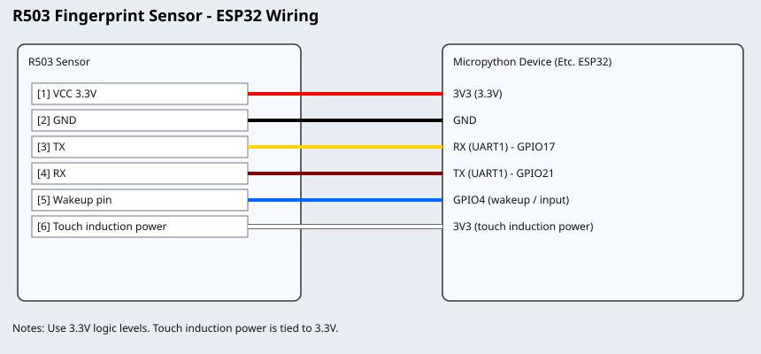

# r503_uPython

[](https://micropython.org/)
[](./LICENSE)

MicroPython library for the R503 fingerprint sensor module running on ESP32.

## Overview

- Compact MicroPython driver (`r503u.py`) implementing the R503 binary protocol over UART.
- Helper functions for enrollment, search, device info and basic device management.
- Target: ESP32 running MicroPython (defaults: UART1 TX=21, RX=17, wakeup_pin=4, baud=57600).

## Features

- Simplified and manual fingerprint enrollment flows.
- Search and match fingerprints (returns matched template index and score).
- Read and decode system parameters and product information.
- Read/write fingerprint index and library management (delete, empty, read count).
- LED control for module status indications.
- Utility functions for baud/security/package-size configuration.
- Wakeup pin support (configured as input). Interrupt-driven behavior is left to the user.

## Interfacing

### Wiring Diagram



### Wiring Connections

| No. | Sensor Side | MicroPython Device Side | Signal | Notes |
| --- | --- | --- | --- | --- |
| 1 | VCC | 3V3 | Power supply | Main sensor supply |
| 2 | GND | GND | Ground | Common ground required |
| 3 | TX | RX (GPIO17, UART1) | UART TX -> RX | Sensor TX connects to device RX |
| 4 | RX | TX (GPIO21, UART1) | UART RX <- TX | Sensor RX connects to device TX |
| 5 | Wakeup pin | GPIO4 | Wakeup signal | Can be used as interrupt source |
| 6 | Touch induction power | 3V3 | Auxiliary power | Tie to 3.3V |

## Voltages and Logic

- Power the sensor with 3.3V.
- Do NOT use 5V for logic lines.
- ESP32 logic is 3.3V and can be connected directly.

## Wakeup Pin / Interrupts

- The class configures a wakeup pin (default GPIO4) and exposes `wakeup_pin_status()`.
- The repository does not include an interrupt-driven API. If needed, attach interrupts in your application.

```py
from machine import Pin

wu = Pin(4, Pin.IN)

def on_wakeup(pin):
    print('Wakeup event', pin.value())

wu.irq(handler=on_wakeup, trigger=Pin.IRQ_FALLING)
```

## Installation

Files to upload to your MicroPython device:

- `main.py` (your application)
- `r503u.py`
- `confirmation_codes.py`

### Using mpremote (CLI)

```bash
mpremote connect COM3 cp r503u.py :
mpremote connect COM3 cp confirmation_codes.py :
mpremote connect COM3 cp main.py :
mpremote connect COM3 run main.py
```

### Alternative: Thonny IDE

- Select the MicroPython (ESP32) interpreter.
- Connect your board.
- Use the Files pane to upload `main.py`, `r503u.py` and `confirmation_codes.py`.

## Usage Examples

These are simple examples for REPL or `main.py`.

### Setup

```py
from r503u import R503
fp = R503()  # defaults: baud=57600, tx_pin=21, rx_pin=17, wakeup_pin=4
```

### 1) `fp.simplified_enroll()`

**Purpose:**
Enroll a fingerprint with a guided, blocking flow. It checks whether the fingerprint already exists and otherwise enrolls into the next free location.

```py
res = fp.simplified_enroll(num_of_fps=4, buff_no=1, timeout=20)
print(res)
```

**Expected output (example):**
- Existing fingerprint: prints `Fingerprint found in the memory, location: 5`, returns `0`.
- New enrollment: prints prompts (`Place your finger...`, `Character file generation successful...`) and returns `0` on success.

### 2) `fp.read_index_table()`

**Purpose:**
Read the template index bitmap and return all occupied memory indices on a given index page.

```py
idx = fp.read_index_table(0)
print(idx)
```

**Expected output (example):**
- `[0, 3, 5, 12]` (stored template positions)
- Returns `99` on communication timeout/error.

### 3) `fp.search()`

**Purpose:**
Capture a fingerprint, generate a template in buffer, and search the configured library range.

```py
res = fp.search(buff_num=1, start_id=0, para=200, timeout=10)
print(res)
```

**Expected output (example):**
- Console: `Place your finger on the sensor...`, then `Searching...`
- Return: `(0, 12, 78)` = `(confirmation_code, template_index, match_score)`
- No match example: `(9, 0, 0)` where `9` means no matching finger found.

### 4) `fp.read_valid_template_num()`

**Purpose:**
Get total number of currently valid fingerprint templates in sensor memory.

```py
print(fp.read_valid_template_num())
```

**Expected output (example):**
- `5`

### 5) `fp.delete_char()`

**Purpose:**
Delete one or more templates starting at a given page index.

```py
rc = fp.delete_char(page_num=3, num_of_temps_to_del=1)
print(rc, fp.confirmation_decode(rc))
```

**Expected output (example):**
- `0 00h: command execution complete`

### 6) `fp.empty_finger_lib()`

**Purpose:**
Erase all stored fingerprint templates from the module.

```py
rc = fp.empty_finger_lib()
print(rc, fp.confirmation_decode(rc))
```

**Expected output (example):**
- `0 00h: command execution complete`

### 7) `fp.read_sys_para_decode()`

**Purpose:**
Read and decode module system parameters into a human-readable dictionary.

```py
print(fp.read_sys_para_decode())
```

**Expected output (example):**

```py
{
  'system_busy': False,
  'matching_finger_found': False,
  'pw_verified': False,
  'valid_image_in_buffer': False,
  'system_id_code': 257,
  'finger_library_size': 200,
  'security_level': 3,
  'device_address': '0xffffffff',
  'data_packet_size': 128,
  'baud_rate': 57600
}
```

### 8) `fp.read_prod_info_decode()`

**Purpose:**
Read and decode manufacturer/module product information.

```py
print(fp.read_prod_info_decode())
```

**Expected output (example):**

```py
{
  'module type': 'GT-521F32',
  'batch number': 'AB12',
  'serial number': '00001234',
  'hw main version': 1,
  'hw sub version': 0,
  'sensor type': 'optical',
  'image width': 256,
  'image height': 288,
  'template size': 512,
  'fp database size': 200
}
```

Returns `99` on communication/read failure.

### 9) `fp.led_control()`

**Purpose:**
Control the onboard LED mode (always on/off, breathing, flashing, etc.).

```py
rc = fp.led_control(ctrl=3, speed=0, color=1, cycles=0)
print(rc, fp.confirmation_decode(rc))
```

**Expected output (example):**
- `0 00h: command execution complete` (`ctrl=3` in this example means always on)
